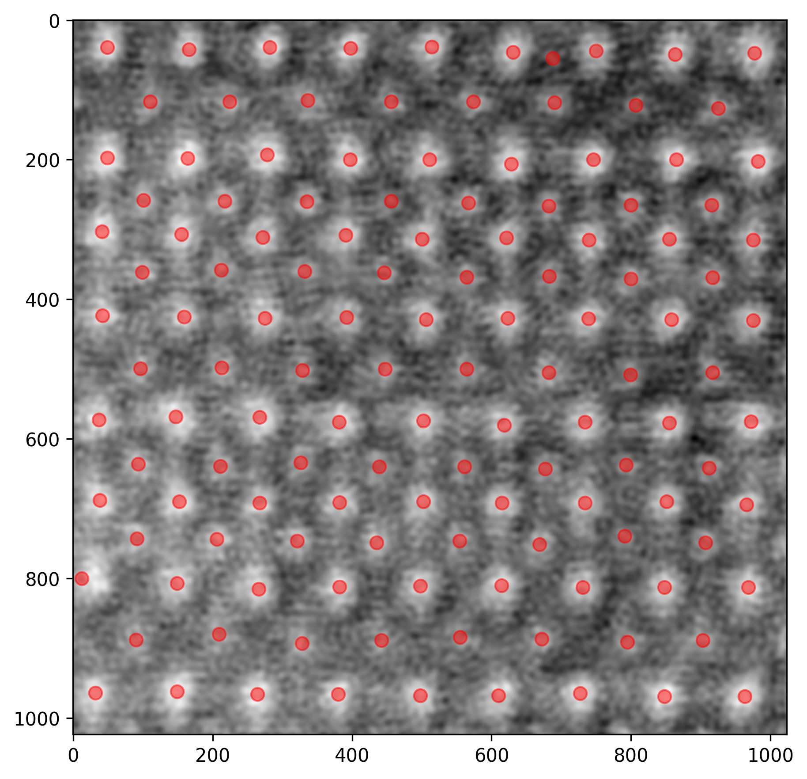
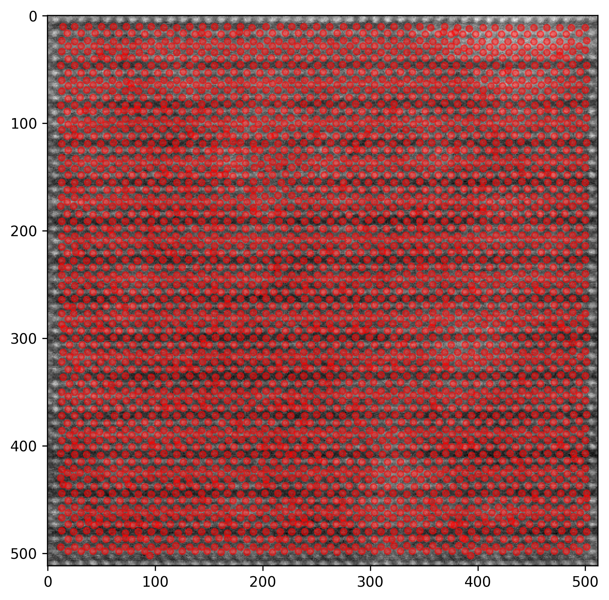

# YBCO Atom Detection with BlobLoG

This repository explores atom detection in **YBCO microscopy images** using **Laplacian of Gaussian blob detection (`blob_log`)**.

## Dataset

The dataset contains **bright-field** and **dark-field** microscopy images of YBCO. Although they capture the same material, these imaging modes produce different contrast, noise levels, and feature visibility. As a result, atomic columns do not appear the same across all images.

## Challenge

The main challenge is reliable atom finding across different image types using `blob_log`.

Detection quality depends strongly on hyperparameters such as:

- `threshold`
- `max_sigma`
- preprocessing choices such as inversion, log scaling, and deconvolution

A parameter setting that works well for one image may fail on another. This is especially important when comparing bright-field and dark-field images, where atomic features can differ significantly in appearance.

## Why this matters

Real-time hyperparameter tuning is difficult because:

- different images require different settings
- small parameter changes can strongly affect detections
- manual tuning is slow and not robust across datasets

## Goal

The goal of this project is to evaluate BlobLoG-based atom detection on YBCO images and show why a single fixed parameter set is not reliable for all microscopy conditions.

## Examples

  
  

